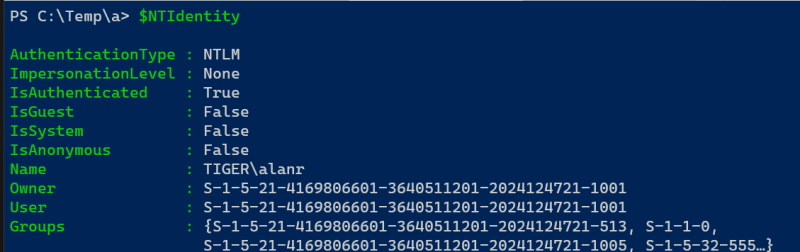

# Powershell commands

## Using Powershell with my NAS

I have created three ``$Profile`` functions to push data from my PC to my NAS.

* ``pushv`` push videos
* ``pushm`` push music
* ``pushmr`` push music rips

## Customizing your PowerShell Profile

First, test to see if you already have a profile.

```powershell
	Test-Path $profile
```

Result:

> False

So we have to set one up.

```powershell
	New-Item -path $profile -type file –force
```

Result:

>     Directory: C:\Users\alanr\Documents\PowerShell        
>       
> Mode                 LastWriteTime         Length Name        
> ----                 -------------         ------ ----        
> -a---           3/06/2022  3:53 PM              0 Microsoft.PowerShell_profile.ps1

The **directory** is where the profile is created and **Name** of the script is.

> Microsoft.PowerShell_profile.ps1

We can add items to this script and they will run the next time we open a powershell terminal window.

These items can be aliases, variables or functions.

### Examples

> new-item alias:np -value "C:\Program Files\Notepad++\notepad++.exe"

I can run this with **np filename.txt**

> $NTIdentity = [Security.Principal.WindowsIdentity]::GetCurrent()

Returns:



## Useful commands

### Search for an item in your history

```powershell
	Get-History | Select-String -Pattern "robocopy"
```

### function Get-StartApps

```powershell
	Get-StartApps
```

Will show you a list of all applications on your system. You can also search for particular applications.

```powershell
	Get-StartApps *SQL*
```

Will show all apps with SQL in their name.

> Name                                            AppID     
> ----                                            -----     
> MySQL Installer - Community                     Microsoft.AutoGenerated.{2C7C9013-A7FD-5C12-D811-939AFE2A3592}        
> jSQL Injection (kali-linux)                     Microsoft.AutoGenerated.{398CBFDB-D3C6-60A9-4B1F-4A3EEC3F6CFD}        
> SQLite database browser (kali-linux)            Microsoft.AutoGenerated.{53B70868-2BE9-ADE0-433C-FCCA08F2F705}    
> DB Browser for SQLite (kali-linux)              Microsoft.AutoGenerated.{99F92F22-CA6F-C72D-819C-291603637C82}        	
> MySQL 8.0 Command Line Client - Unicode         Microsoft.AutoGenerated.{B6ECABB1-7A68-AC3C-1F61-8F8089041EDD}        
> MySQL 8.0 Command Line Client                   Microsoft.AutoGenerated.{DF60CA8F-4884-F0EE-090A-264B39A0FD55}        
> ...

### Get drive sizes

In this case we will make a variable.

```powershell
	$dr = Get-WmiObject Win32_logicalDisk -computername localhost -filter "drivetype=3" | Select-Object DeviceID,
	@{Name="SizeMB";Expression={$_.size/1MB -as [int]}},
	@{Name="FreeMB";Expression={$_.freespace/1mb -as [int]}},
	@{Name="PctFree";Expression={[math]::round(($_.freespace/$_.size)*100,2)}}
```

Results:

> DeviceID  SizeMB FreeMB PctFree       	
> --------  ------ ------ -------       
> C:        952059 563117   59.15       
> D:       2000000 394220   19.71       
> E:       2000000 725596   36.28       
> F:       1723036 546402   31.71       
> G:       7630868 591597    7.75

I have created a function named **drives** and it runs from my ``$Profile``.

### Open Explorer

Open the current Powershell directory

```powershell
	ii .
```

Or.

```powershell
	open .
```

Or.

```powershell
	start .
```

Or.

```powershell
	explorer .
```

If you want to change to another directory (this can also be on another drive).

```powershell
	open D:\Alan\Drives
```

### Minimising or maximising applications

For example I have Notepad++ open in full screen. I can minimise it with the following keys.

``Win + Down arrow``

To maximise.

``Win + Up arrow``
